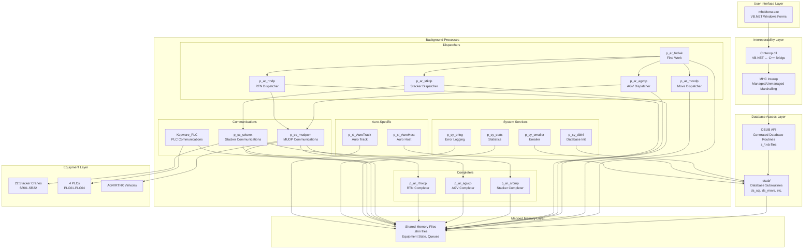

# Component Dependency Map

**Document Version:** 1.0
**Last Updated:** 2024-12-22
**Author:** PlinyHub HARVEST
**Confidence Score:** 0.90

---

## Overview

This document shows how major modules depend on each other in the Auro System, including dependencies between background processes, shared libraries, and UI components.

---

## Dependency Hierarchy

---

## Dependency Details

### UI Layer Dependencies

**mhcMenu.exe** depends on:
- `CInterop.dll` - For accessing C++ functions from VB.NET
- `MHC Interop` - For marshalling between managed/unmanaged code
- `OSUB API` - For database access (z_*.vb files)
- `vb.dll` - For mapped memory access

### Database Access Layer Dependencies

**OSUB API** (z_*.vb files) depends on:
- `dsub/` - Database subroutines (ds_sql, ds_movs, ds_load, etc.)
- SQL Server database connection

**dsub/** depends on:
- SQL Server database
- Mapped memory (for some operations)

### Background Process Dependencies

#### Dispatchers
- **p_ar_fndwk** → Mapped Memory, Database
- **p_ar_movdp** → Mapped Memory, Database, dsub
- **p_ar_stkdp** → Mapped Memory, Database, dsub, cc_stk (stacker classes)
- **p_ar_agvdp** → Mapped Memory, Database, cc_agv (AGV classes)
- **p_ar_rtndp** → Mapped Memory, Database, cc_rtnx (RTNX classes)

#### Completers
- **p_ar_srcmp** → Mapped Memory, Database, dsub, cc_stk
- **p_ar_agvcp** → Mapped Memory, Database, dsub, cc_agv
- **p_ar_rtnxcp** → Mapped Memory, Database, dsub, cc_rtnx

#### Communication Services
- **p_cc_stkcmx** → Mapped Memory, cc_stk, Communication protocols (MUDP/MASPA/CRC)
- **p_cc_mudpcm** → Mapped Memory, cc_agv, cc_rtnx, MUDP protocol
- **Kepware_PLC** → Kepware OPC Server, Mapped Memory, cc_plc

#### System Services
- **p_sy_dbini** → Database, Configuration files (menu.cnf, database_tables.xml)
- **p_sy_stats** → Mapped Memory, Database
- **p_sy_emailer** → Database, Email server
- **p_sy_erlog** → Mapped Memory, Log files

### Auro-Specific Dependencies

- **p_si_AuroHost** → Database, Host communication protocols
- **p_si_AuroTrack** → Mapped Memory, Tracking systems
- **p_si_stkcmx** → Mapped Memory, Site-specific stacker protocols

---

## Shared Library Dependencies

### Core Libraries (csub/)
- `cc_stk.h/cpp` - Stacker classes (used by p_ar_stkdp, p_ar_srcmp, p_cc_stkcmx)
- `cc_std.h/cpp` - Station classes
- `cc_plc.h/cpp` - PLC classes (used by Kepware_PLC)
- `cc_agv.h/cpp` - AGV classes (used by p_ar_agvdp, p_ar_agvcp)
- `cc_rtnx.h/cpp` - RTNX classes (used by p_ar_rtndp, p_ar_rtnxcp)
- `cc_zone.h/cpp` - Zone classes
- `cc_gg.h` - Global definitions

### Database Libraries (dsub/)
- `ds_sql.cpp` - SQL interface (used by all database operations)
- `ds_movs.cpp` - Move database functions
- `ds_load.cpp` - Load database functions
- `ds_invt.cpp` - Inventory database functions
- `ds_locn.cpp` - Location database functions

### Operating System Libraries (osub/)
- Generated OSUB routines (z_*.cpp) - Used by C++ processes
- Generated OSUB routines (z_*.vb) - Used by VB.NET dialogs

---

## Build Dependencies

### Build Order
1. **Core Libraries:** csub, dsub, osub, cryptlib
2. **Communication Libraries:** ccsub (if exists)
3. **Background Processes:** p_ar_*, p_cc_*, p_sy_*, p_si_*, p_tk_*
4. **VB.NET Projects:** MHC_Interop → GenScript → mhcMenu

### Runtime Dependencies
- All processes require mapped memory files initialized by `p_sy_gcini`
- All processes require database connection (initialized by `p_sy_dbini`)
- Communication processes require equipment to be online

---

## Related Documents

- [Architecture Overview](00_Architecture_Overview.md)
- [Data Flow Diagrams](02_Data_Flow_Diagrams.md)
- [Process Startup Sequence](04_Process_Startup_Sequence.md)
- [IPC and Shared Memory](05_IPC_and_Shared_Memory.md)
- [Code Reference Index](../03_Code_Reference/00_Code_Index.md)

---

## Cross-References

| Topic | Document | Section |
|-------|----------|---------|
| Architecture Overview | [Architecture Overview](00_Architecture_Overview.md) | System Layers |
| Process Details | [Code Reference](../03_Code_Reference/01_Background_Processes/) | Process Documentation |
| Shared Libraries | [Code Reference](../03_Code_Reference/03_Shared_Libraries/) | Library Documentation |
| Startup Order | [Process Startup Sequence](04_Process_Startup_Sequence.md) | Startup Sequence |
| Data Flow | [Data Flow Diagrams](02_Data_Flow_Diagrams.md) | Flow Diagrams |

---

## Changelog

| Version | Date | Changes |
|---------|------|---------|
| 1.0 | 2024-12-22 | Initial creation |

