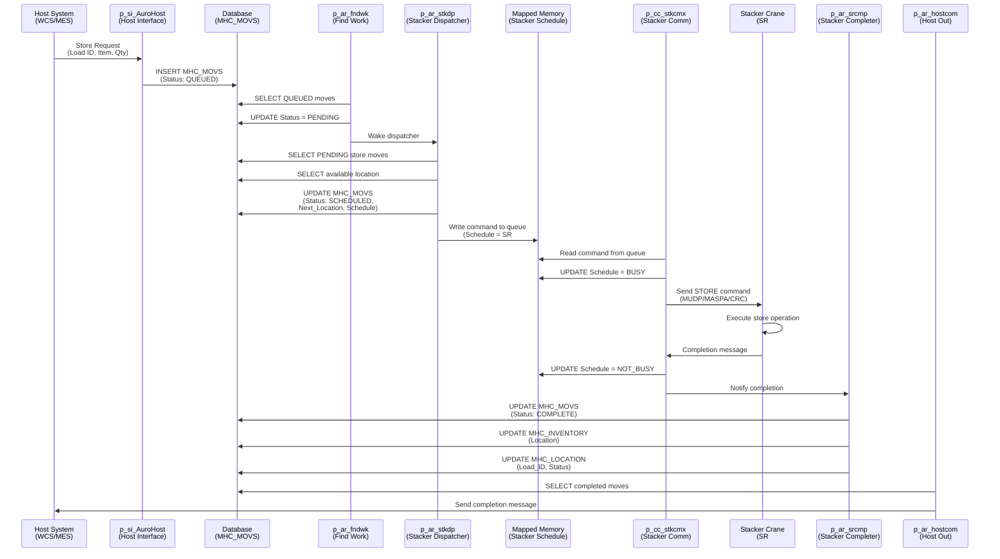
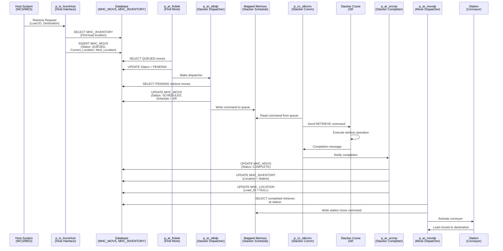
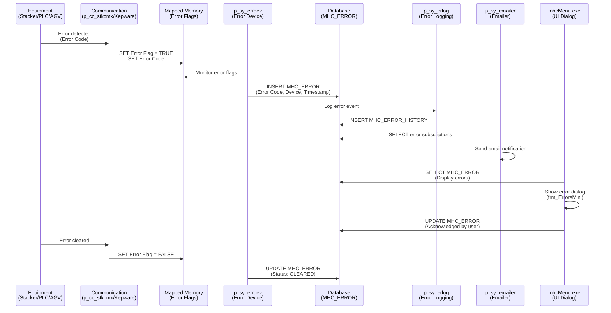
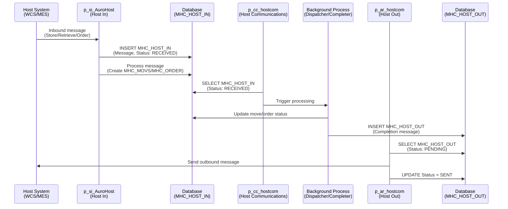
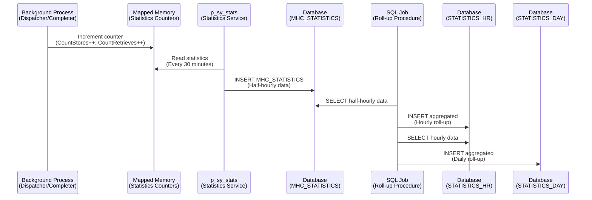

# Data Flow Diagrams

**Document Version:** 1.0
**Last Updated:** 2024-12-22
**Author:** PlinyHub HARVEST
**Confidence Score:** 0.90

---

## Overview

This document provides detailed data flow diagrams for critical operations in the Auro System, showing how data moves through processes, databases, and mapped memory.

---

## Inbound Move (Store Operation) Flow

---

## Outbound Move (Retrieve Operation) Flow

---

## Error Handling Flow

---

## Host Communication Flow

---

## Statistics Collection Flow

---

## Related Documents

- [Architecture Overview](00_Architecture_Overview.md)
- [Component Dependency Map](01_Component_Dependency_Map.md)
- [Process Startup Sequence](04_Process_Startup_Sequence.md)
- [Inbound Move Workflow](../05_Workflows/01_Inbound_Move.md)
- [Outbound Move Workflow](../05_Workflows/02_Outbound_Move.md)
- [Equipment Fault Handling](../05_Workflows/03_Equipment_Fault_Handling.md)

---

## Cross-References

| Topic | Document | Section |
|-------|----------|---------|
| Inbound Move Details | [Inbound Move Workflow](../05_Workflows/01_Inbound_Move.md) | Step-by-Step |
| Outbound Move Details | [Outbound Move Workflow](../05_Workflows/02_Outbound_Move.md) | Step-by-Step |
| Error Handling Details | [Equipment Fault Handling](../05_Workflows/03_Equipment_Fault_Handling.md) | Error Flow |
| Process Details | [Code Reference](../03_Code_Reference/01_Background_Processes/) | Process Documentation |
| Database Tables | [Database Reference](../04_Database_Reference/00_Database_Overview.md) | Table Documentation |

---

## Changelog

| Version | Date | Changes |
|---------|------|---------|
| 1.0 | 2024-12-22 | Initial creation |

