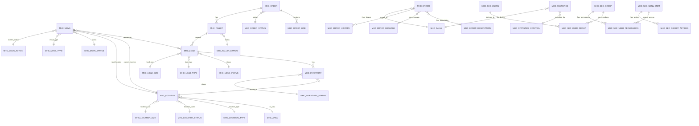

# Database ERD

**Document Version:** 1.0
**Last Updated:** 2024-12-22
**Author:** PlinyHub HARVEST
**Confidence Score:** 0.85

---

## Overview

This document provides Entity-Relationship Diagrams (ERD) for the Auro System database, showing relationships between core tables.

---

## Core Entity Relationships

---

## Core Tables

### MHC_MOVS (Move Records)
- **Primary Key:** Move_ID
- **Foreign Keys:**
  - Load_ID → MHC_LOAD
  - Current_Location → MHC_LOCATION
  - Next_Location → MHC_LOCATION
  - Move_Status → MHC_MOVS_STATUS
  - Move_Type → MHC_MOVS_TYPE
- **Relationships:**
  - One-to-Many with MHC_LOAD (one load can have multiple moves)
  - Many-to-One with MHC_LOCATION (current and next locations)

### MHC_LOAD (Load Records)
- **Primary Key:** Load_ID
- **Foreign Keys:**
  - Load_Status → MHC_LOAD_STATUS
  - Load_Type → MHC_LOAD_TYPE
  - Load_Size → MHC_LOAD_SIZE
- **Relationships:**
  - One-to-Many with MHC_INVENTORY (load can be in multiple inventory records)
  - Many-to-One with MHC_PALLET (load can belong to a pallet)

### MHC_INVENTORY (Inventory Records)
- **Primary Key:** Inventory_ID
- **Foreign Keys:**
  - Load_ID → MHC_LOAD
  - Location → MHC_LOCATION
  - Status → MHC_INVENTORY_STATUS
- **Relationships:**
  - Many-to-One with MHC_LOAD
  - Many-to-One with MHC_LOCATION

### MHC_LOCATION (Location Records)
- **Primary Key:** Location
- **Foreign Keys:**
  - Area → MHC_AREA
  - Location_Type → MHC_LOCATION_TYPE
  - Location_Status → MHC_LOCATION_STATUS
  - Location_Size → MHC_LOCATION_SIZE
- **Relationships:**
  - One-to-Many with MHC_INVENTORY (location can hold multiple inventory items)
  - One-to-Many with MHC_MOVS (as current or next location)

### MHC_ORDER (Order Records)
- **Primary Key:** Order_ID
- **Foreign Keys:**
  - Order_Status → MHC_ORDER_STATUS
- **Relationships:**
  - One-to-Many with MHC_ORDER_LINE
  - One-to-Many with MHC_PALLET

### MHC_ERROR (Error Records)
- **Primary Key:** Error_ID
- **Foreign Keys:**
  - Device → MHC_Device
  - Error_Code → MHC_ERROR_DESCRIPTION
- **Relationships:**
  - One-to-Many with MHC_ERROR_HISTORY
  - Many-to-One with MHC_Device

---

## Equipment Tables

### MHC_SM2DB_STACKER (Stacker State)
- **Primary Key:** Aisle (SR01-SR22)
- **Relationships:**
  - Referenced by mapped memory for real-time state
  - Linked to MHC_MOVS via Schedule field

### MHC_SM2DB_STATION (Station State)
- **Primary Key:** Station_ID
- **Relationships:**
  - Referenced by mapped memory for real-time state
  - Linked to MHC_MOVS via station locations

### MHC_SM2DB_COMMS (Communication State)
- **Primary Key:** Device_ID
- **Relationships:**
  - Tracks communication status for all devices

---

## Security Tables

### MHC_SEC_USERS (Users)
- **Primary Key:** User_ID
- **Relationships:**
  - Many-to-Many with MHC_SEC_GROUP via MHC_SEC_USER_GROUP

### MHC_SEC_GROUP (Groups)
- **Primary Key:** Group_ID
- **Relationships:**
  - Many-to-Many with MHC_SEC_USERS via MHC_SEC_USER_GROUP
  - One-to-Many with MHC_SEC_USER_PERMISSIONS

### MHC_SEC_MENU_ITEM (Menu Items/Dialogs)
- **Primary Key:** MenuItem_ID
- **Relationships:**
  - One-to-Many with MHC_SEC_OBJECT_ACTIONS
  - One-to-Many with MHC_SEC_USER_PERMISSIONS

---

## Log Tables

All log tables follow the pattern `[TABLE_NAME]_LOG`:
- **MHC_MOVS_LOG** - Logs all changes to MHC_MOVS
- **MHC_LOAD_LOG** - Logs all changes to MHC_LOAD
- **MHC_INVENTORY_LOG** - Logs all changes to MHC_INVENTORY
- **MHC_LOCATION_LOG** - Logs all changes to MHC_LOCATION
- **MHC_ORDER_LOG** - Logs all changes to MHC_ORDER
- **MHC_PALLET_LOG** - Logs all changes to MHC_PALLET
- **MHC_ERROR_QUEUE_LOG** - Logs error queue changes
- **MHC_ELEMENTS_LOG** - Logs configuration element changes

---

## Views

Key views that combine multiple tables:
- **VIEW_LOAD_INVT** - Combines MHC_LOAD and MHC_INVENTORY
- **VIEW_LOCN_LOAD** - Combines MHC_LOCATION and MHC_LOAD
- **VIEW_MOV_LOAD_INVT** - Combines MHC_MOVS, MHC_LOAD, and MHC_INVENTORY
- **VIEW_RACK_INQ** - Rack inquiry view
- **VIEW_RACKLOCN** - Rack location view
- **VIEW_SEC_MENU** - Security menu view
- **VIEW_SEC_PERM** - Security permissions view

---

## Related Documents

- [Database Overview](../04_Database_Reference/00_Database_Overview.md)
- [Core Tables](../04_Database_Reference/01_Core_Tables/)
- [Equipment Tables](../04_Database_Reference/02_Equipment_Tables/)
- [Log Tables](../04_Database_Reference/03_Log_Tables/)
- [MHC-Developers-Guide Database](https://github.com/0xPliny/MHC-Developers-Guide/tree/main/04_Database_Reference) - Generic database patterns

---

## Cross-References

| Topic | Document | Section |
|-------|----------|---------|
| Table Details | [Database Overview](../04_Database_Reference/00_Database_Overview.md) | Table List |
| MHC_MOVS | [MHC_MOVS](../04_Database_Reference/01_Core_Tables/MHC_MOVS.md) | Schema |
| MHC_LOAD | [MHC_LOAD](../04_Database_Reference/01_Core_Tables/MHC_LOAD.md) | Schema |
| MHC_LOCATION | [MHC_LOCATION](../04_Database_Reference/01_Core_Tables/MHC_LOCATION.md) | Schema |
| MHC_INVENTORY | [MHC_INVENTORY](../04_Database_Reference/01_Core_Tables/MHC_INVENTORY.md) | Schema |
| Workflows | [Workflow Index](../05_Workflows/00_Workflow_Index.md) | Database Usage |

---

## Changelog

| Version | Date | Changes |
|---------|------|---------|
| 1.0 | 2024-12-22 | Initial creation |

