# Complete Documentation Specification

**Purpose:** When the framework bootstraps a project, generate **exhaustive documentation** covering every aspect of the system with full relationship mapping.

---

## DOCUMENTATION REQUIREMENTS

When bootstrapping a project, the AI MUST generate ALL of the following:

---

## SECTION 0: Project Overview

### 0.1 System Summary

- Project name, purpose, customer
- System type (ASRS, conveyor, shuttle, etc.)
- High-level capabilities
- Key metrics (# cranes, # locations, throughput)

### 0.2 Master Relationship Map

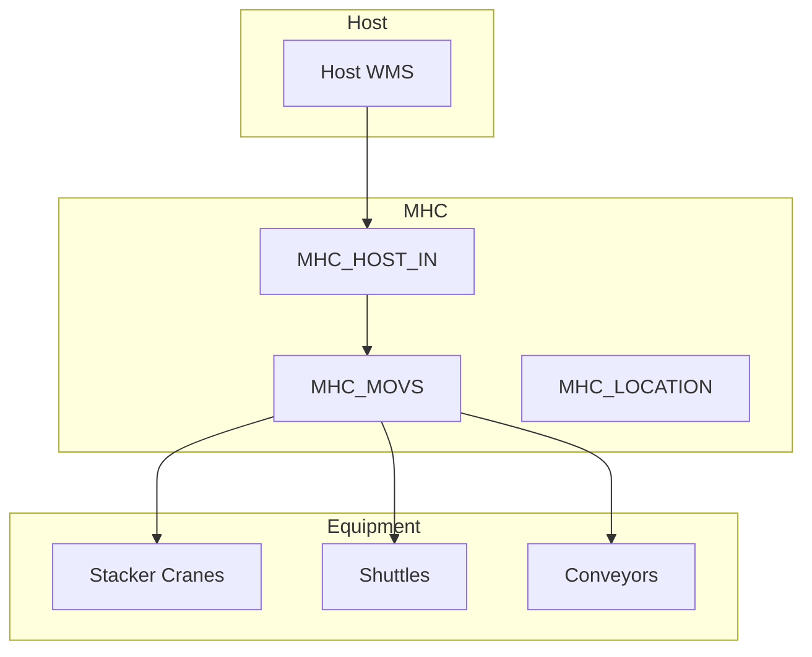

### 0.3 Quick Start Guide

- 15-minute onboarding
- Key concepts
- First tasks

---

## SECTION 1: System Architecture

### 1.1 System Overview

- Complete data flow diagram
- All system layers (Host, MHC, PLC, Equipment)
- Communication protocols

### 1.2 Process Architecture

```
Generate for EVERY process:
- Process name
- Purpose
- Input/output
- Dependencies
- Database tables used
- Configuration keys
- Log file
```

### 1.3 Process Relationship Map

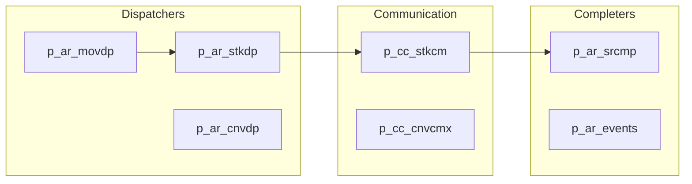

### 1.4 Shared Memory Map

- All shared memory segments
- Structure definitions
- Read/write ownership
- Update frequencies

---

## SECTION 2: Equipment Control

### For EACH equipment type, document

#### 2.X Equipment Type Documentation

- Equipment name and quantity
- Physical description
- Communication protocol
- Dispatcher service
- Communication service
- Completer service
- Status codes
- Error codes
- Recovery procedures

#### 2.X.1 Equipment Relationship Map

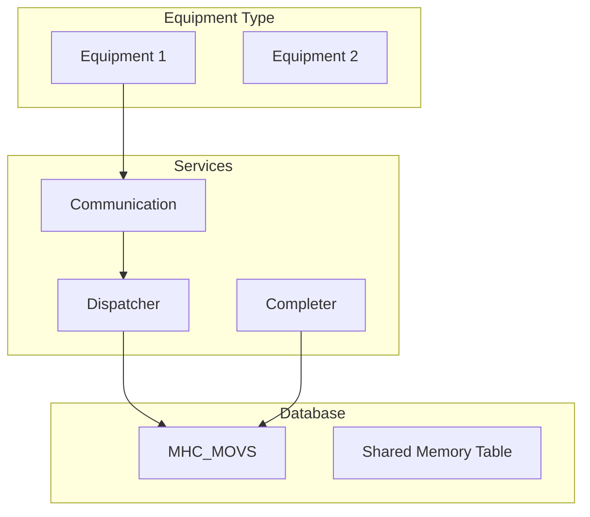

#### 2.X.2 State Machine

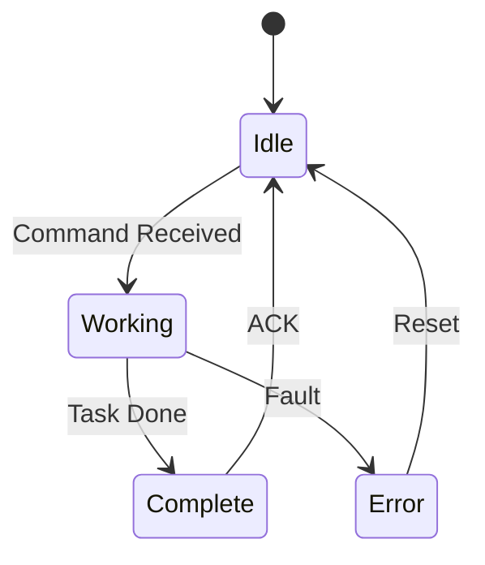

---

## SECTION 3: Database Reference

### 3.1 Table Catalog

For EVERY table in the database:

```
- Table name
- Purpose
- Columns (all)
- Primary key
- Foreign keys
- Indexes
- Triggers
- Row count estimate
- Retention policy
```

### 3.2 Table Relationship Map (ERD)

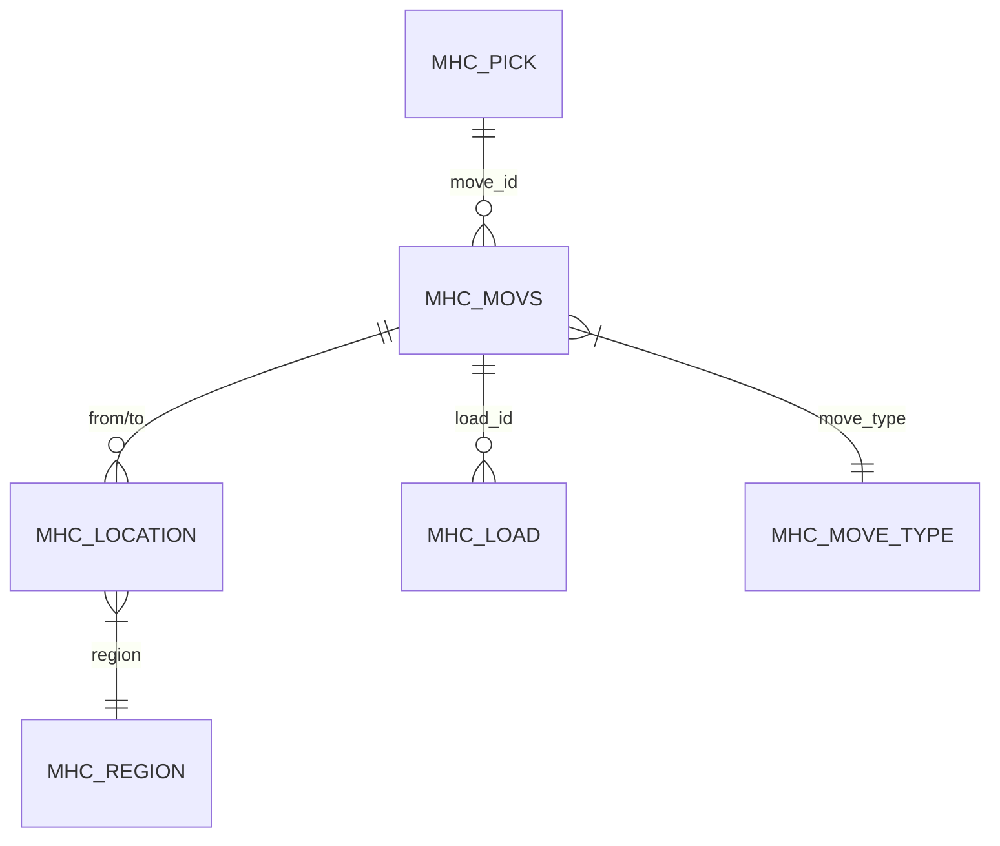

### 3.3 Stored Procedure Catalog

For EVERY stored procedure:

```
- Procedure name
- Purpose
- Parameters
- Return values
- Tables affected
- Called by (services)
- Calls (other procedures)
```

### 3.4 View Catalog

For EVERY view:

```
- View name
- Purpose
- Base tables
- Indexed? (yes/no)
- Used by (services)
```

### 3.5 Function Catalog

For EVERY function:

```
- Function name
- Purpose
- Parameters
- Return type
- Used by
```

### 3.6 Trigger Catalog

For EVERY trigger:

```
- Trigger name
- Table
- Event (INSERT/UPDATE/DELETE)
- Purpose
- Side effects
```

---

## SECTION 4: Configuration Reference

### 4.1 DBINI Configuration

For EVERY configuration key:

```
- Key name
- Section
- Data type
- Default value
- Valid values
- Purpose
- Used by (services)
```

### 4.2 Stand/Station Definitions

For EVERY stand:

```
- Stand name
- Type
- Region
- Equipment assignment
- PLC address
- DCB bits
```

### 4.3 Stand Relationship Map

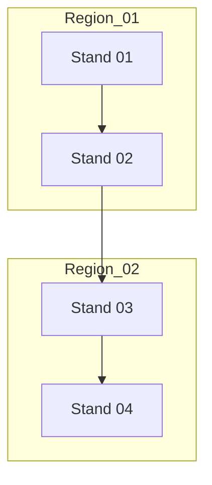

### 4.4 DCB Bit Mapping

For EVERY DCB bit:

```
- Bit address
- Name
- Direction (input/output)
- Purpose
- PLC tag
```

### 4.5 Registry Settings

For EVERY registry key:

```
- Key path
- Value name
- Data type
- Default
- Purpose
```

### 4.6 Elements Table

For EVERY element:

```
- Item_Key
- Item_Value
- Data type
- Purpose
- Modified by
```

---

## SECTION 5: Code Reference

### 5.1 Service Catalog

For EVERY service/process:

```
- Service name
- Source file(s)
- Entry point
- Main loop function
- Key functions (list all)
- Database tables used
- Shared memory used
- Configuration keys
- Log file
```

### 5.2 Function Reference

For EVERY significant function:

```
- Function name
- File
- Purpose
- Parameters
- Return value
- Called by
- Calls
- Database operations
- Error handling
```

### 5.3 Class Reference (VB.NET)

For EVERY class:

```
- Class name
- Namespace
- Purpose
- Properties
- Methods
- Events
- Inheritance
- Dependencies
```

### 5.4 Code Relationship Map

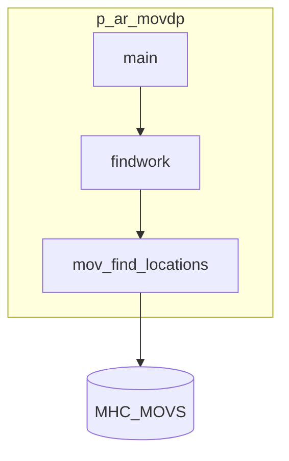

---

## SECTION 6: Communication Reference

### 6.1 Protocol Documentation

For EVERY communication protocol:

```
- Protocol name
- Equipment type
- Service
- Port/address
- Message format
- Commands (all)
- Responses
- Error handling
- Timing
```

### 6.2 Message Catalog

For EVERY message type:

```
- Message ID
- Direction
- Fields
- Purpose
- Sequence diagram
```

### 6.3 Communication Flow Maps

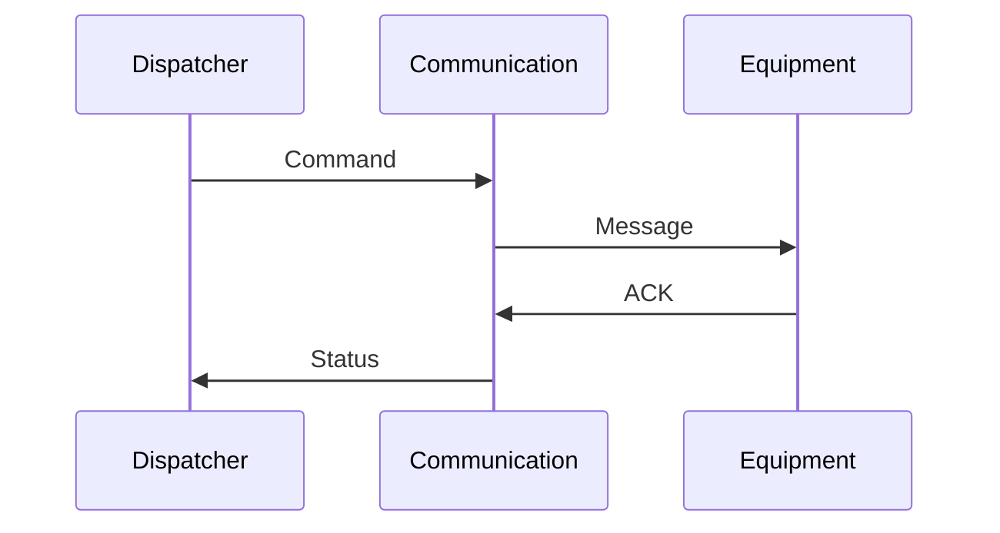

---

## SECTION 7: Move & Material Flow

### 7.1 Move Type Catalog

For EVERY move type:

```
- Move type code
- Description
- From region(s)
- To region(s)
- Equipment used
- Steps
- Status progression
```

### 7.2 Move Lifecycle Map

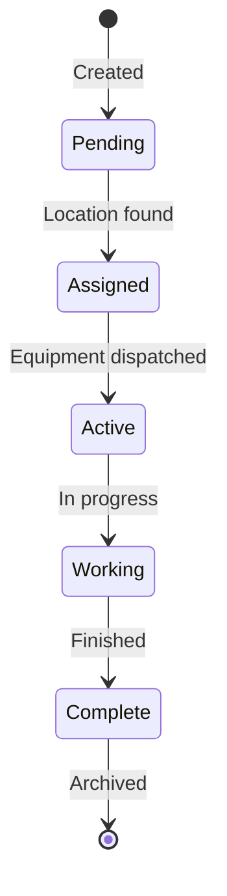

### 7.3 Routing Logic

For EVERY routing scenario:

```
- From region
- To region
- Path (stands traversed)
- Equipment sequence
- Decision points
```

### 7.4 Material Flow Map


---

## SECTION 8: UI Reference

### 8.1 Form Catalog

For EVERY form:

```
- Form name
- Purpose
- Menu location
- Controls
- Events
- Database interactions
- Security permissions
```

### 8.2 UI Navigation Map

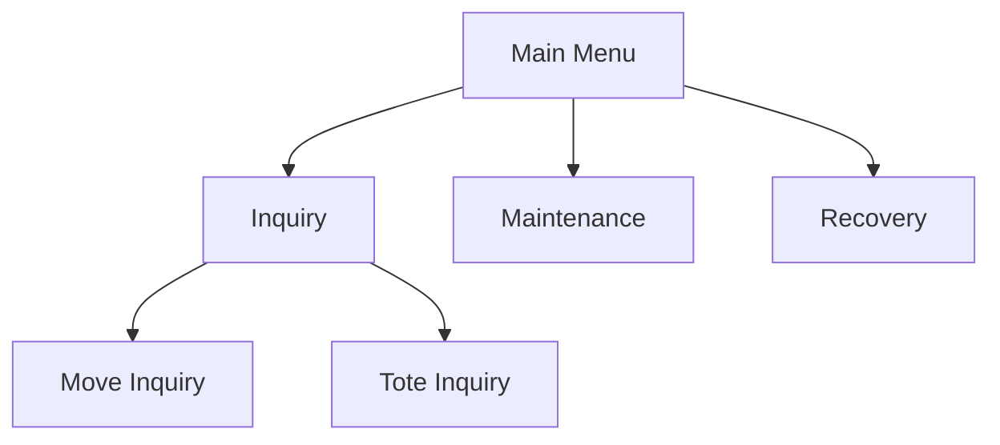

### 8.3 Security Matrix

```
For EVERY role:
- Role name
- Description
- Form access (list)
- Function access (list)
```

---

## SECTION 9: Troubleshooting

### 9.1 Decision Trees

For EVERY issue category:

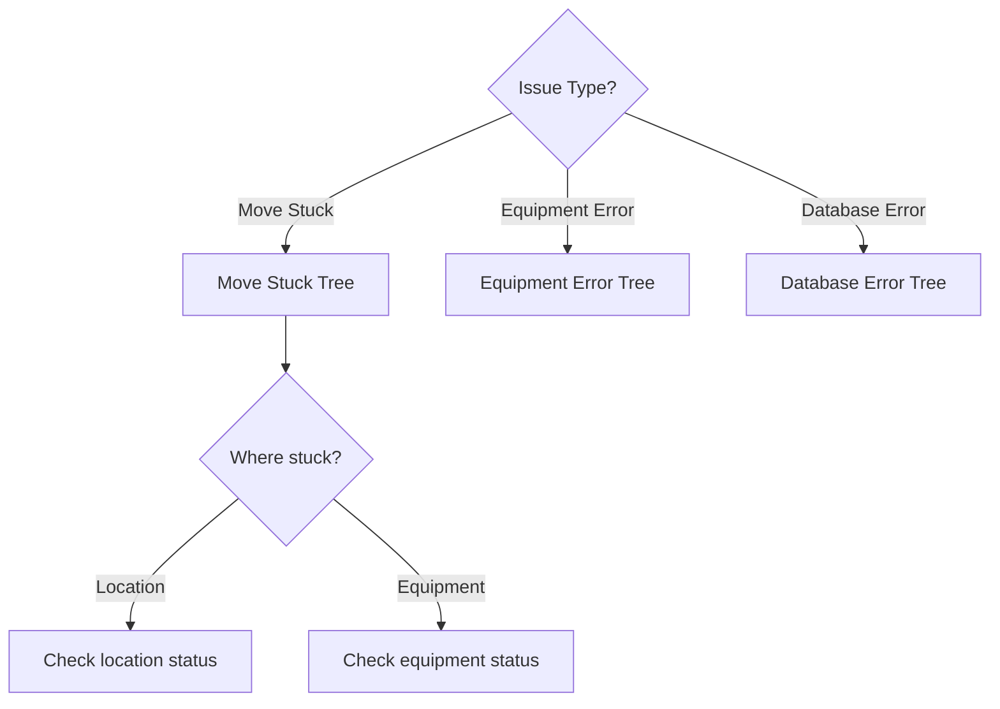

### 9.2 Error Code Reference

For EVERY error code:

```
- Error code
- Source
- Description
- Cause
- Resolution steps
- Prevention
```

### 9.3 Common Issues

For EVERY common issue:

```
- Symptom
- Cause
- Diagnosis steps
- Resolution
- SQL queries to help
- Prevention
```

---

## SECTION 10: Quick Reference

### 10.1 SQL Quick Reference

Common queries for:

- Move status
- Equipment status
- Location status
- Pick status
- Error lookup

### 10.2 Status Code Reference

ALL status codes for:

- Moves
- Locations
- Equipment
- Picks
- Transfers

### 10.3 Command Reference

ALL utility commands:

- Service start/stop
- Database utilities
- Diagnostic tools

### 10.4 Keyboard Shortcuts

ALL UI shortcuts

---

## RELATIONSHIP MAPPING REQUIREMENTS

Every relationship map MUST include:

### Required Diagrams

1. **System Overview** - All major components
2. **Process Flow** - How services interact
3. **Data Flow** - How data moves through system
4. **Equipment Hierarchy** - Physical relationships
5. **Database ERD** - Table relationships
6. **State Machines** - For each entity type
7. **Sequence Diagrams** - For each workflow
8. **Navigation Maps** - UI structure
9. **Decision Trees** - Troubleshooting flows

### Diagram Format

Use Mermaid syntax for all diagrams:

- `graph TB/LR` for hierarchies and flows
- `erDiagram` for database relationships
- `stateDiagram-v2` for state machines
- `sequenceDiagram` for interactions
- `gantt` for timelines if needed

---

## COMPLETENESS CHECKLIST

Before documentation is considered complete:

### Coverage

- [ ] EVERY process documented
- [ ] EVERY database table documented
- [ ] EVERY stored procedure documented
- [ ] EVERY configuration key documented
- [ ] EVERY stand/station documented
- [ ] EVERY equipment type documented
- [ ] EVERY move type documented
- [ ] EVERY UI form documented
- [ ] EVERY error code documented

### Relationships

- [ ] System overview diagram
- [ ] Process relationship map
- [ ] Database ERD
- [ ] Equipment hierarchy
- [ ] Stand/region map
- [ ] Move flow diagram
- [ ] UI navigation map
- [ ] Troubleshooting decision trees

### Usability

- [ ] Quick start guide
- [ ] Quick reference cards
- [ ] Common task examples
- [ ] Emergency procedures

---

## OUTPUT STRUCTURE

The generated documentation MUST follow this folder structure:

```
docs/
├── README.md                           # Master index with relationship map
├── 00_Quick_Start_Guide.md             # 15-minute onboarding
├── 01_System_Architecture/
│   ├── 01_System_Overview.md           # With data flow diagram
│   ├── 02_Process_Architecture.md      # With process map
│   └── 03_Shared_Memory.md             # With structure diagrams
├── 02_Equipment_Control/
│   └── [Equipment].md                  # For each equipment type
├── 03_Database_Reference/
│   ├── 01_Tables.md                    # With ERD
│   ├── 02_Stored_Procedures.md
│   ├── 03_Views.md
│   ├── 04_Functions.md
│   └── 05_Triggers.md
├── 04_Configuration_Reference/
│   ├── 01_DBINI.md
│   ├── 02_Stands.md                    # With stand map
│   ├── 03_DCB.md
│   └── 04_Registry.md
├── 05_Code_Reference/
│   ├── 01_Services.md
│   └── 02_Functions.md
├── 06_Communication/
│   └── 01_Protocols.md                 # With sequence diagrams
├── 07_Move_Flow/
│   ├── 01_Move_Types.md
│   └── 02_Routing.md                   # With flow diagram
├── 08_UI_Reference/
│   ├── 01_Forms.md
│   └── 02_Security.md                  # With navigation map
├── 09_Troubleshooting/
│   └── [Issue_Type].md                 # With decision trees
└── 10_Quick_Reference/
    ├── 01_SQL_Reference.md
    ├── 02_Status_Codes.md
    ├── 03_Error_Codes.md
    └── 04_Commands.md
```

---

**This specification ensures COMPLETE documentation with FULL relationship mapping for ANY system.**
