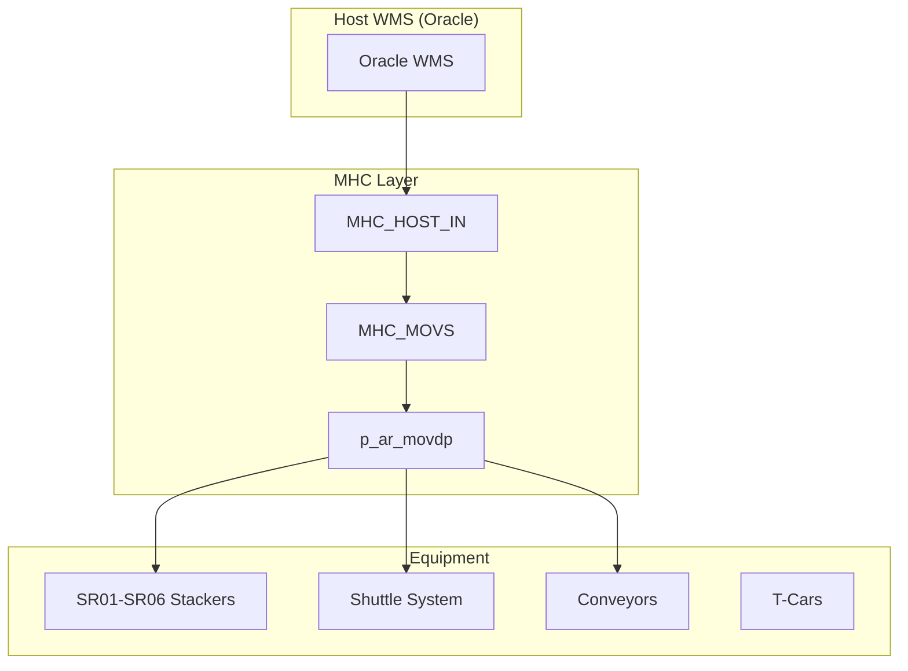
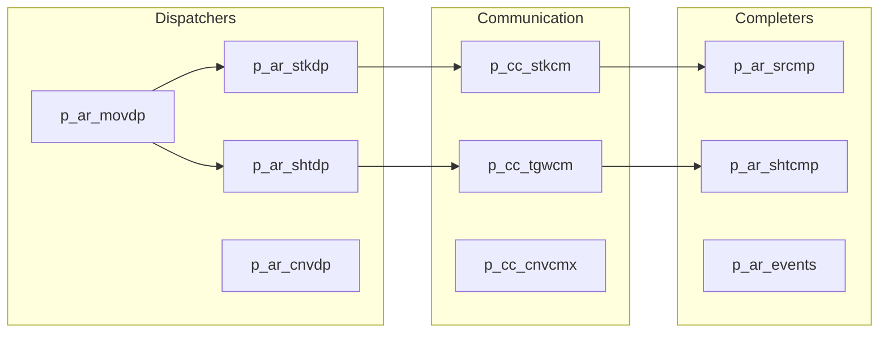
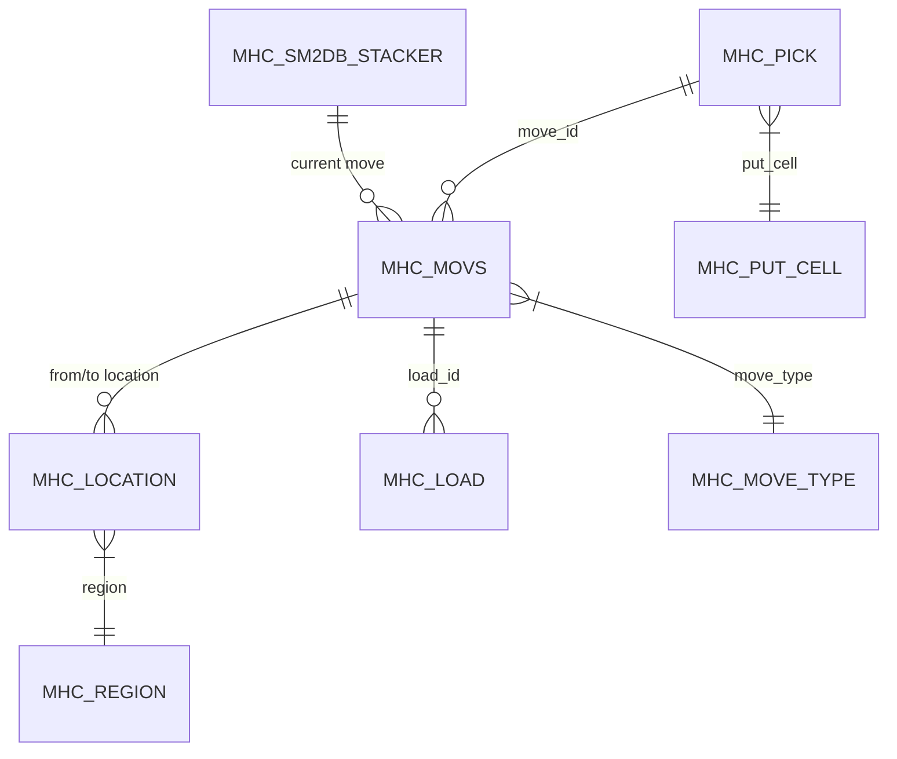
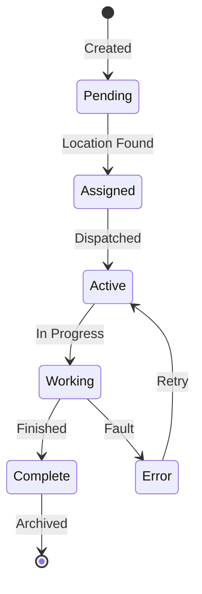
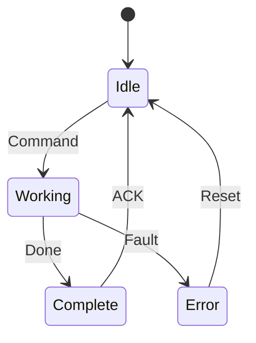
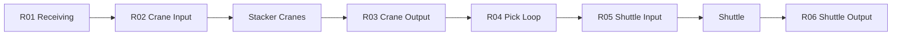
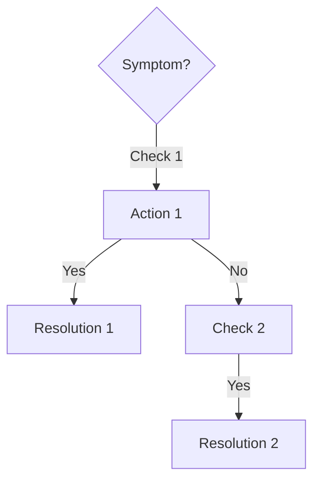

# Fast-Dhub Complete Documentation Prompt

**Copy this entire file to Cursor or another AI assistant.**

---

# DOCUMENTATION TASK

You are a senior Murata MHC/MEM engineer (CmL). Your task is to generate **complete, exhaustive documentation** for the Fast-Dhub system with full relationship mapping.

## PROJECT INFORMATION

- **Project Name:** Fast-Dhub
- **System Type:** Fastenal Distribution Hub - Material Handling Control (MHC/MEM)
- **Source Directory:** `D:\ICIS\Fast-DhubDev`
- **Production Directory:** `D:\Fast-DHUBMini2023`
- **Database:** SQL Server (Fast-Dhub)

---

## YOUR TASK

Generate comprehensive documentation following this exact structure. **Document EVERYTHING - every table, every procedure, every service, every configuration key.**

---

## REQUIRED OUTPUT STRUCTURE

Create this folder structure with all files:

```
docs/
├── README.md                           # Master index with system overview diagram
├── 00_Quick_Start_Guide.md             # 15-minute developer onboarding
│
├── 01_System_Architecture/
│   ├── 01_System_Overview.md           # Data flow diagram (Mermaid)
│   ├── 02_Process_Architecture.md      # All services with relationship map
│   └── 03_Shared_Memory.md             # SM structures and ownership
│
├── 02_Equipment_Control/
│   ├── 01_Stacker_Cranes_SR01-SR06.md  # TGW Revolution stackers
│   ├── 02_Shuttle_System.md            # TGW shuttle (Aisle 41)
│   ├── 03_T-Car_Control.md             # Transfer cars
│   ├── 04_Conveyor_System.md           # Conveyor routing
│   └── 05_Lifter_Control.md            # Vertical transport
│
├── 03_Move_Management/
│   ├── 01_Move_Types.md                # All move types with state diagrams
│   ├── 02_Move_Dispatcher.md           # p_ar_movdp
│   └── 03_Routing_Logic.md             # Region routing with flow diagram
│
├── 04_Pick_Operations/
│   ├── 01_Pick_to_Light.md             # p_ar_Pick2Light
│   ├── 02_Flow_Rail.md                 # Replenishment logic
│   └── 03_Put_Cell_Management.md       # P01-P16 put cells
│
├── 05_Database_Reference/
│   ├── 01_Core_Tables.md               # MHC_MOVS, MHC_LOCATION, etc.
│   ├── 02_Configuration_Tables.md      # Config schema
│   ├── 03_Stored_Procedures.md         # ALL stored procedures
│   ├── 04_Functions.md                 # ALL SQL functions
│   ├── 05_Triggers.md                  # ALL triggers
│   ├── 06_Views.md                     # ALL views
│   └── 07_ERD.md                       # Entity Relationship Diagram
│
├── 06_Configuration_Reference/
│   ├── 01_DBINI_Configuration.md       # ALL DBINI keys
│   ├── 02_Stands_Configuration.md      # ALL stands with map
│   ├── 03_DCB_Configuration.md         # ALL DCB bits
│   ├── 04_Registry_Settings.md         # ALL registry keys
│   └── 05_Elements_Table.md            # MHC_ELEMENTS keys
│
├── 07_Code_Reference/
│   ├── 01_Area_Programs.md             # p_ar_* services
│   ├── 02_Communication_Programs.md    # p_cc_* services
│   ├── 03_Tracking_Programs.md         # p_tk_* services
│   ├── 04_Key_Functions.md             # Important functions
│   └── 05_VB_NET_Classes.md            # UI layer classes
│
├── 08_Communication/
│   ├── 01_TGW_Stacker_Protocol.md      # Stacker communication
│   ├── 02_TGW_Shuttle_Protocol.md      # Shuttle communication
│   ├── 03_PLC_Communication.md         # Allen-Bradley
│   └── 04_Host_Interface.md            # Oracle WMS integration
│
├── 09_UI_Reference/
│   ├── 01_MHC_Menu_Application.md      # Main application
│   ├── 02_Inquiry_Forms.md             # Move, tote, location inquiry
│   ├── 03_Maintenance_Forms.md         # Tote, location maintenance
│   ├── 04_Recovery_Forms.md            # Equipment recovery
│   └── 05_Security_Matrix.md           # Roles and permissions
│
├── 10_Troubleshooting/
│   ├── 01_Move_Issues.md               # Decision tree for stuck moves
│   ├── 02_Equipment_Faults.md          # Decision tree for equipment
│   ├── 03_Database_Issues.md           # Decision tree for DB problems
│   ├── 04_Communication_Errors.md      # Decision tree for comms
│   └── 05_Performance_Issues.md        # Decision tree for performance
│
└── 11_Quick_Reference/
    ├── 01_Process_Reference.md         # All services quick lookup
    ├── 02_SQL_Quick_Reference.md       # Common queries
    ├── 03_Status_Codes.md              # All status codes
    ├── 04_Error_Codes.md               # All error codes
    └── 05_Commands.md                  # Utility commands
```

---

## MANDATORY RELATIONSHIP DIAGRAMS

Include these Mermaid diagrams:

### 1. System Overview (in README.md)



### 2. Process Relationship Map (in 01_System_Overview.md)



### 3. Database ERD (in 07_ERD.md)



### 4. Move State Machine (in 01_Move_Types.md)



### 5. Equipment State Machine (in each equipment doc)



### 6. Region Routing Map (in 03_Routing_Logic.md)



---

## FOR EACH SERVICE, DOCUMENT

```markdown
## Service: [name]

**Source:** [file path]
**Purpose:** [description]
**Log File:** [log path]

### Configuration
| Key | Purpose | Default |
|-----|---------|---------|

### Database Tables
| Table | Usage |
|-------|-------|

### Key Functions
| Function | Purpose |
|----------|---------|

### Relationship to Other Services
[Mermaid diagram showing connections]
```

---

## FOR EACH DATABASE TABLE, DOCUMENT

```markdown
## Table: [name]

**Purpose:** [description]
**Row Count:** [estimate]
**Retention:** [policy]

### Columns
| Column | Type | Nullable | Description |
|--------|------|----------|-------------|

### Keys
- **Primary:** [columns]
- **Foreign:** [relationships]

### Indexes
| Index | Columns | Purpose |
|-------|---------|---------|

### Used By
| Service | Operation |
|---------|-----------|
```

---

## FOR EACH TROUBLESHOOTING ISSUE, CREATE DECISION TREE

```markdown
## Issue: [symptom]

### Decision Tree


### Common Causes

1. [Cause 1] → [Resolution]
2. [Cause 2] → [Resolution]

### SQL Diagnostics

```sql
-- Query to diagnose
SELECT ...
```

```

---

## MURATA MHC STANDARDS TO DOCUMENT

In the Quick Start and throughout, emphasize:
- `cc_str.copy()`, `cc_str.comp()` for strings
- Generated database classes (`MOVS_`, `LOCN_`, etc.)
- `cs_log_printf()` for logging
- `cs_reg_read()` for configuration
- `GP.GOOD`, `GP.BAD`, `SQL.HELD` return codes
- `SQL.start()`, `SQL.commit()`, `SQL.rollback()` for transactions
- `CmL MM/DD/YYYY:` comment format

---

## COMPLETENESS CHECKLIST

Before finishing, verify:
- [ ] Every C++ service (p_ar_*, p_cc_*, p_tk_*) documented
- [ ] Every database table documented with columns
- [ ] Every stored procedure documented
- [ ] Every DBINI key documented
- [ ] Every stand documented
- [ ] Every equipment type documented
- [ ] Every move type documented
- [ ] Every UI form documented
- [ ] Every error code documented
- [ ] System overview diagram included
- [ ] Process relationship map included
- [ ] Database ERD included
- [ ] Move state machine included
- [ ] Troubleshooting decision trees included

---

## BEGIN DOCUMENTATION

Start by exploring:
1. `D:\ICIS\Fast-DhubDev\MSVC Programs\` - C++ services
2. `D:\ICIS\Fast-DhubDev\MSVB Programs\` - VB.NET UI
3. `D:\Fast-DHUBMini2023\File\` - Configuration files
4. Database schema

Then generate all documentation files following the structure above.

**Branding:** Use "CmL" as author, "Pliny HARVEST" as framework.
